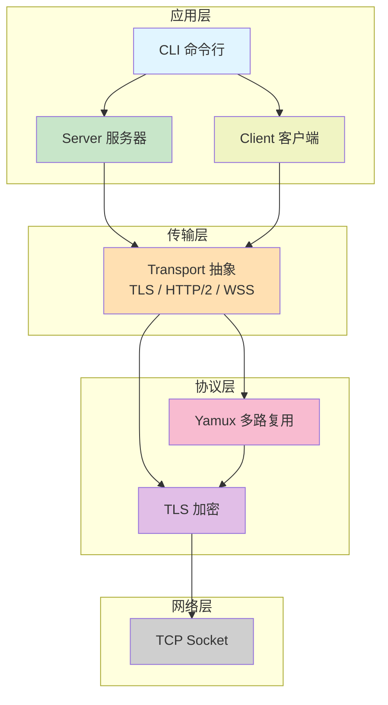
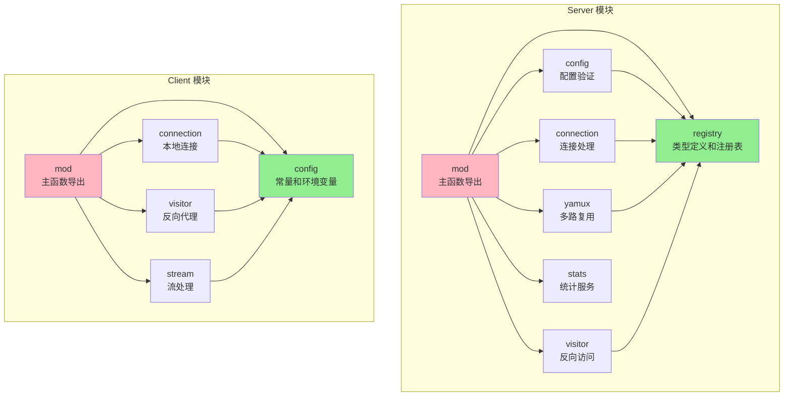

# TLS Tunnel - 基于 TLS 的反向代理隧道

一个使用 Rust、Tokio、Rustls、Yamux 和 Clap 构建的高性能 TLS 反向代理隧道程序。

## 功能特性

- 🔒 **安全的 TLS 加密通信**
- 🔑 **密钥认证机制**（防止未授权访问）
- 🚀 **高性能异步 I/O**（基于 Tokio）
- 🔄 **双向数据转发**
- 📝 **灵活的配置文件**（TOML 格式）
- 🎯 **多代理支持**（一个客户端可以管理多个端口转发）
- � **Visitor 模式**（客户端可以访问服务器端的服务，实现反向访问）
- �🛠️ **模块化设计**，易于扩展和维护
- 🌊 **多路复用**（基于 Yamux，单个 TLS 连接支持多个并发流）
- 📦 **动态配置**（服务器无需配置代理，由客户端动态提供）
- 🔁 **自动重连**（客户端断线后自动重连，本地服务连接失败自动重试）
- ✅ **配置验证**（客户端和服务器端双重验证，防止配置冲突）
- 📋 **错误反馈**（服务器拒绝连接时返回详细错误信息）
- 🌐 **多传输协议**（支持 TLS、HTTP/2、WebSocket）
- 🔧 **反向代理支持**（支持在 Nginx 等代理服务器后端运行）
- 📊 **实时监控**（内置统计服务器和终端监控工具）

## 传输协议

tls-tunnel 支持三种传输协议：

1. **TLS**（默认）：原生 TLS over TCP，性能最佳
2. **HTTP/2**：使用 HTTP/2 CONNECT 方法，可穿透 HTTP 代理
3. **WebSocket**：使用 WebSocket Secure (WSS)，最大兼容性

详细对比和使用指南：
- [HTTP/2 传输使用指南](HTTP2_USAGE.md)
- [WebSocket 传输使用指南](WSS_USAGE.md)
- [传输协议对比](TRANSPORT_COMPARISON.md)
- [反向代理配置指南](REVERSE_PROXY.md)

## 架构设计

本程序使用**多路复用**技术（Yamux），通过单个 TLS 连接传输多个独立的数据流，并支持两种工作模式：

- **Proxy 模式**：外部用户通过服务器访问内网服务（传统反向代理）
- **Visitor 模式**：内网客户端互相访问彼此的服务（反向访问）

详细的架构设计、工作流程和系统拓扑图请参考 [完整架构文档](docs/ARCHITECTURE.md)。

## 快速开始

### 0. 生成配置文件（可选）

可以使用内置工具生成配置文件模板（推荐放在 `examples/` 下）：

```bash
# 生成服务器配置
./tls-tunnel generate server -o examples/server.toml

# 生成客户端配置
./tls-tunnel generate client -o examples/client.toml

# 查看配置示例（不保存到文件）
./tls-tunnel generate server

# 检查配置文件是否有效
./tls-tunnel check -c examples/server.toml
./tls-tunnel check -c examples/client.toml
```

### 1. 生成 TLS 证书

建议使用示例目录存放开发证书：`examples/certs/`

**在 Linux/macOS 上：**
```bash
cd examples/certs
chmod +x generate-cert.sh
./generate-cert.sh
```

**在 Windows 上（使用 PowerShell）：**
```powershell
cd examples\certs
./generate-cert.ps1
```

### 2. 配置服务器

编辑 `examples/server.toml` 文件：

```toml

[server]
# 服务器绑定地址
bind_addr = "0.0.0.0"
# 服务器监听端口
bind_port = 8443

# TLS 证书路径
cert_path = "examples/certs/cert.pem"
# TLS 私钥路径
key_path = "examples/certs/key.pem"

# 认证密钥（客户端必须提供相同的密钥才能连接）
# 请修改为你自己的强密码！
auth_key = "your-secret-auth-key-change-me"

# 注意：不再需要配置代理列表，客户端会自动提供
```

### 3. 配置客户端

编辑 `examples/client.toml` 文件：

```toml

[client]
# 服务器地址
server_addr = "your-server.com"
# 服务器 TLS 端口
server_port = 8443

# 是否跳过证书验证（仅用于测试，生产环境请设置为 false）
skip_verify = true
# CA 证书路径（如果 skip_verify = false）
ca_cert_path = "examples/certs/cert.pem"

# 认证密钥（必须与服务器端一致）
auth_key = "your-secret-auth-key-change-me"

# 代理配置列表
[[proxies]]
name = "web-service"
# 服务器发布端口（外部访问该端口）
publish_port = 8080
# 客户端本地服务端口（转发到该端口）
local_port = 3000
# 代理类型（可选，默认为 tcp）
# - tcp: 原始 TCP 连接，不复用连接（适用于 SSH、数据库等需要独立连接的服务）
# - http/1.1: HTTP/1.1 长连接，支持连接复用（适用于 HTTP/1.1 Web 服务）
# - http/2.0: HTTP/2.0，单连接多路复用（适用于 HTTP/2 服务，自动限制为单个连接）
proxy_type = "http/1.1"

[[proxies]]
name = "api-service"
publish_port = 8081
local_port = 3001
proxy_type = "http/2.0"

[[proxies]]
name = "ssh-tunnel"
publish_port = 2222
local_port = 22
proxy_type = "tcp"  # SSH 需要独立连接，不复用

# Visitor 配置（可选）：客户端访问服务器端服务
[[visitors]]
name = "mysql-visitor"
bind_addr = "127.0.0.1"    # 本地监听地址
bind_port = 3306           # 本地监听端口
server_name = "mysql"      # 服务器端的 proxy 名称
```

**使用 Visitor 模式时，服务器端也需要配置对应的 proxy：**

```toml
# 服务器端 examples/server.toml

[[proxies]]
name = "mysql"            # 对应客户端 visitor 的 server_name
type = "tcp"
local_addr = "127.0.0.1"
local_port = 3306
# 注意：不需要配置 publish_addr/publish_port
# 这个 proxy 只用于 visitor 访问，不对外公开
```

### 4. 运行程序

**在服务器上：**
```bash
./tls-tunnel -c examples/server.toml server
```

**在客户端上：**
```bash
./tls-tunnel -c examples/client.toml client
```

### 5. 测试

**测试 Proxy 模式（外部访问客户端）：**
```bash
curl http://your-server.com:8080
```

**测试 Visitor 模式（客户端访问服务器）：**
```bash
# 在客户端机器上，连接本地 3306 端口
mysql -h 127.0.0.1 -P 3306 -u user -p
# 实际会通过隧道连接到服务器的 MySQL
```

### 6. 停止服务

- **优雅关闭**：按 `Ctrl+C`，服务器会优雅关闭所有连接
- **客户端**：按 `Ctrl+C` 停止，会自动尝试重连（除非终止进程）

## Visitor 模式详解

Visitor 模式允许客户端通过服务器中转访问另一个客户端的服务，实现客户端到客户端的内网穿透。

### 使用场景

1. **访问远程数据库**：客户端C需要连接客户端B上的 MySQL、PostgreSQL 等数据库
2. **访问内部 API**：客户端C需要调用客户端B所在内网的 API 服务
3. **远程开发调试**：开发者需要访问远程开发环境的服务
4. **安全访问**：避免在公网暴露端口，只通过加密隧道实现客户端间访问

### 完整文档

详细的使用指南、配置说明、最佳实践和故障排查，请参考：

📖 **[Visitor 模式完整指南](docs/guides/VISITOR.md)**

### 配置示例

完整的配置示例请参考：
- [examples/visitor-client.toml](examples/visitor-client.toml) - Visitor 端配置（客户端C）
- [examples/visitor-server.toml](examples/visitor-server.toml) - Proxy 端配置（客户端B）

### 工作原理

1. 客户端C在 `[[visitors]]` 中定义要访问的服务
2. 客户端C在本地绑定端口（`bind_port`）
3. 本地应用连接到客户端C的 `bind_port`
4. 客户端C通过 yamux 创建新的 stream 到服务器
5. 客户端C发送目标 `(name, publish_port)`
6. 服务器在注册表中查找匹配的 proxy
7. 服务器通过客户端B的连接请求创建到本地服务的 stream
8. 建立双向数据转发通道

### Visitor 与 Proxy 的区别

| 特性 | Proxy 模式 | Visitor 模式 |
|------|-----------|-------------|
| 方向 | 外部 → 服务器 → 客户端 | 客户端 → 服务器 |
| 监听端口 | 服务器端 | 客户端端 |
| 目标服务 | 客户端本地服务 | 服务器端本地服务 |
| 使用场景 | 暴露客户端服务到公网 | 客户端访问服务器私有服务 |

## 高级配置

### 代理类型与连接池

每个代理支持三种类型，影响连接池的复用行为：

#### 1. TCP 模式（`proxy_type = "tcp"`）
- **特点**：每个请求使用独立的连接，不复用
- **适用场景**：SSH、数据库、需要保持独立连接状态的服务
- **连接池行为**：获取连接后不返回池中，使用完即关闭

#### 2. HTTP/1.1 模式（`proxy_type = "http/1.1"`）
- **特点**：支持 Keep-Alive 长连接，连接复用
- **适用场景**：HTTP/1.1 Web 服务、RESTful API
- **连接池行为**：使用后返回池中，多个请求可复用同一连接
- **健康检查**：复用前检查连接是否仍然有效（防止复用已关闭的连接）

#### 3. HTTP/2.0 模式（`proxy_type = "http/2.0"`）
- **特点**：单连接多路复用，所有请求共享一个连接
- **适用场景**：HTTP/2 服务
- **连接池行为**：强制 max_size=1，保持单个持久连接

### 连接池环境变量

客户端支持通过环境变量调整连接池参数：

```bash
# 连接池最小空闲连接数（默认：2）
export TLS_TUNNEL_POOL_MIN_IDLE=2

# 连接池最大连接数（默认：10，HTTP/2 强制为 1）
export TLS_TUNNEL_POOL_MAX_SIZE=10

# 空闲连接最大存活时间，秒（默认：300）
export TLS_TUNNEL_POOL_MAX_IDLE_SECS=300

# 连接超时时间，毫秒（默认：5000）
export TLS_TUNNEL_POOL_CONNECT_TIMEOUT_MS=5000

# TCP Keepalive 时间，秒（可选）
export TLS_TUNNEL_POOL_KEEPALIVE_SECS=60

# TCP Keepalive 间隔，秒（可选）
export TLS_TUNNEL_POOL_KEEPALIVE_INTERVAL_SECS=10
```

### 重连参数

客户端支持通过环境变量调整重连参数：

```bash
# 设置重连延迟（秒）
export TLS_TUNNEL_RECONNECT_DELAY_SECS=10

# 设置本地服务连接重试次数
export TLS_TUNNEL_LOCAL_CONNECT_RETRIES=5

# 设置本地服务连接重试延迟（毫秒）
export TLS_TUNNEL_LOCAL_RETRY_DELAY_MS=2000

# 启动客户端
./tls-tunnel client -c examples/client.toml
```

Windows (PowerShell):
```powershell
$env:TLS_TUNNEL_RECONNECT_DELAY_SECS=10
$env:TLS_TUNNEL_LOCAL_CONNECT_RETRIES=5
$env:TLS_TUNNEL_LOCAL_RETRY_DELAY_MS=2000
$env:TLS_TUNNEL_POOL_MAX_SIZE=20
.\tls-tunnel.exe client -c examples/client.toml
```

### 日志级别

使用 `-l` 或 `--log-level` 参数调整日志详细程度：

```bash
# 详细调试日志
./tls-tunnel -l debug server -c examples/server.toml

# 仅显示警告和错误
./tls-tunnel -l warn client -c examples/client.toml

# 可用级别: trace, debug, info, warn, error
```

## 使用场景

### 场景 1：内网穿透

将内网服务暴露到公网：
- **服务器**：有公网 IP 的 VPS
- **客户端**：内网机器（运行本地服务）
- **效果**：外部用户可以通过公网 IP 访问内网服务

### 场景 2：开发环境共享

与团队成员共享本地开发环境：
- **服务器**：团队共享的开发服务器
- **客户端**：你的本地开发机器
- **效果**：团队成员可以访问你本地的开发服务

### 场景 3：多服务代理

同时代理多个服务：
- 配置多个 `[[proxies]]` 条目
- 每个服务使用不同的端口
- 单个 TLS 连接处理所有代理

## 命令行选项

```bash
# 使用配置文件
./tls-tunnel -c examples/server.toml server
./tls-tunnel -c examples/client.toml client

# 设置日志级别
./tls-tunnel -c examples/server.toml --log-level debug server
./tls-tunnel -c examples/client.toml --log-level info client

# 查看帮助
./tls-tunnel --help
./tls-tunnel server --help
./tls-tunnel client --help
```

## 构建

```bash
# 构建项目
cargo build --release

# 运行测试
cargo test

# 查看文档
cargo doc --open
```

## 项目结构

```
tls-tunnel/
├── src/
│   ├── main.rs              # 程序入口
│   ├── cli.rs               # CLI 参数解析
│   ├── config.rs            # 配置文件结构
│   ├── tls.rs               # TLS 证书加载
│   ├── transport.rs         # 传输层抽象（TLS/HTTP2/WSS）
│   ├── connection_pool.rs   # 连接池管理
│   ├── stats.rs             # 统计数据结构
│   ├── server/              # 服务器模块（拆分为7个子模块）
│   │   ├── mod.rs           # 主模块和 run_server 函数
│   │   ├── registry.rs      # 代理注册表和全局状态
│   │   ├── config.rs        # 配置验证
│   │   ├── connection.rs    # 代理连接处理
│   │   ├── yamux.rs         # Yamux 连接管理
│   │   ├── visitor.rs       # Visitor 模式处理
│   │   └── stats.rs         # 统计服务器
│   └── client/              # 客户端模块（拆分为5个子模块）
│       ├── mod.rs           # 主模块和 run_client 函数
│       ├── config.rs        # 配置常量和环境变量
│       ├── connection.rs    # 本地连接和连接池
│       ├── stream.rs        # Yamux stream 处理
│       └── visitor.rs       # Visitor 反向代理
├── Cargo.toml               # 依赖配置
├── examples/
│   ├── server.toml          # 服务器配置示例
│   ├── client.toml          # 客户端配置示例
│   ├── visitor-server.toml  # Visitor 模式 - Proxy 端
│   ├── visitor-client.toml  # Visitor 模式 - Visitor 端
│   └── certs/
│       ├── cert.pem         # 开发用证书
│       ├── key.pem          # 开发用私钥
│       ├── generate-cert.ps1 # Windows 证书生成
│       └── generate-cert.sh  # Linux/macOS 证书生成
├── docs/                    # 详细文档
│   ├── SUMMARY.md           # 功能总结
│   ├── guides/              # 使用指南
│   └── development/         # 开发文档
├── README.md                # 本文件
├── CHANGELOG.md             # 更新日志
└── LICENSE                  # MIT 许可证
```

### 架构分层



### 模块依赖关系



## 技术栈

- **Rust** - 系统编程语言
- **Tokio** - 异步运行时
- **Rustls** - TLS 实现
- **Yamux** - 多路复用协议
- **Clap** - CLI 参数解析
- **Serde** - 序列化/反序列化
- **TOML** - 配置文件格式

## 安全建议

1. **修改默认密钥**：请务必修改 `auth_key`，使用强密码
2. **使用有效证书**：生产环境应使用受信任的 CA 签发的证书
3. **启用证书验证**：客户端配置中设置 `skip_verify = false`
4. **限制监听地址**：服务器可以绑定到特定 IP 而不是 `0.0.0.0`
5. **防火墙规则**：仅开放必要的端口

## 协议设计

### 握手协议

1. TLS 握手
2. 客户端 → 服务器：认证密钥长度（4字节）+ 认证密钥
3. 服务器 → 客户端：认证结果（1字节：1=成功，0=失败）
4. 客户端 → 服务器：代理数量（2字节）
5. 对每个代理：名称长度（2字节）+ 名称 + 发布端口（2字节）+ 本地端口（2字节）
6. 建立 Yamux 连接

### 数据传输

1. 服务器接受外部连接
2. 服务器通过 Yamux 创建新 stream
3. 服务器 → 客户端：目标端口（2字节）
4. 客户端连接本地服务
5. 双向转发数据

## 📚 文档

- **快速开始**：[快速入门指南](docs/guides/QUICKSTART.md)
- **使用示例**：[详细使用示例](docs/guides/EXAMPLES.md)
- **监控统计**：
  - [统计功能说明](docs/STATISTICS.md)
  - [Top 命令使用指南](docs/TOP_USAGE.md)
- **开发文档**：
  - [架构设计](docs/development/ARCHITECTURE.md)
  - [协议说明](docs/development/PROTOCOL.md)
  - [重连机制](docs/development/RECONNECTION.md)
  - [开发指南](docs/development/DEVELOPMENT.md)
  - [测试指南](docs/development/TESTING.md)
- **项目总览**：[功能总结](docs/SUMMARY.md)
- **更新日志**：[CHANGELOG.md](CHANGELOG.md)

## 许可证

MIT

## 贡献

欢迎提交 Issue 和 Pull Request！

## 作者

TLS Tunnel Project
