# TLS Tunnel 架构设计

本文档详细说明 TLS Tunnel 的架构设计、系统拓扑、工作流程和数据转发机制。

## 系统拓扑图

完整的系统拓扑，展示所有组件的交互关系：

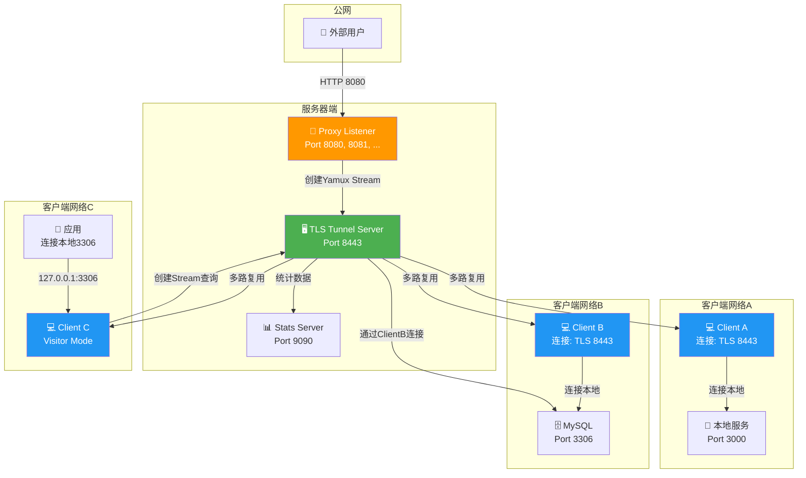

## 架构分层

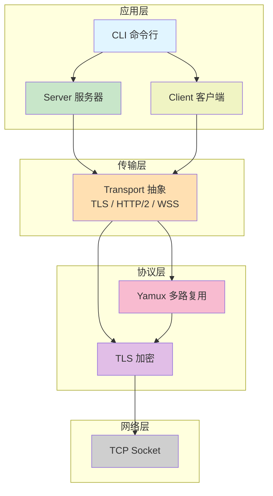

## 模块依赖关系

### Server 模块结构

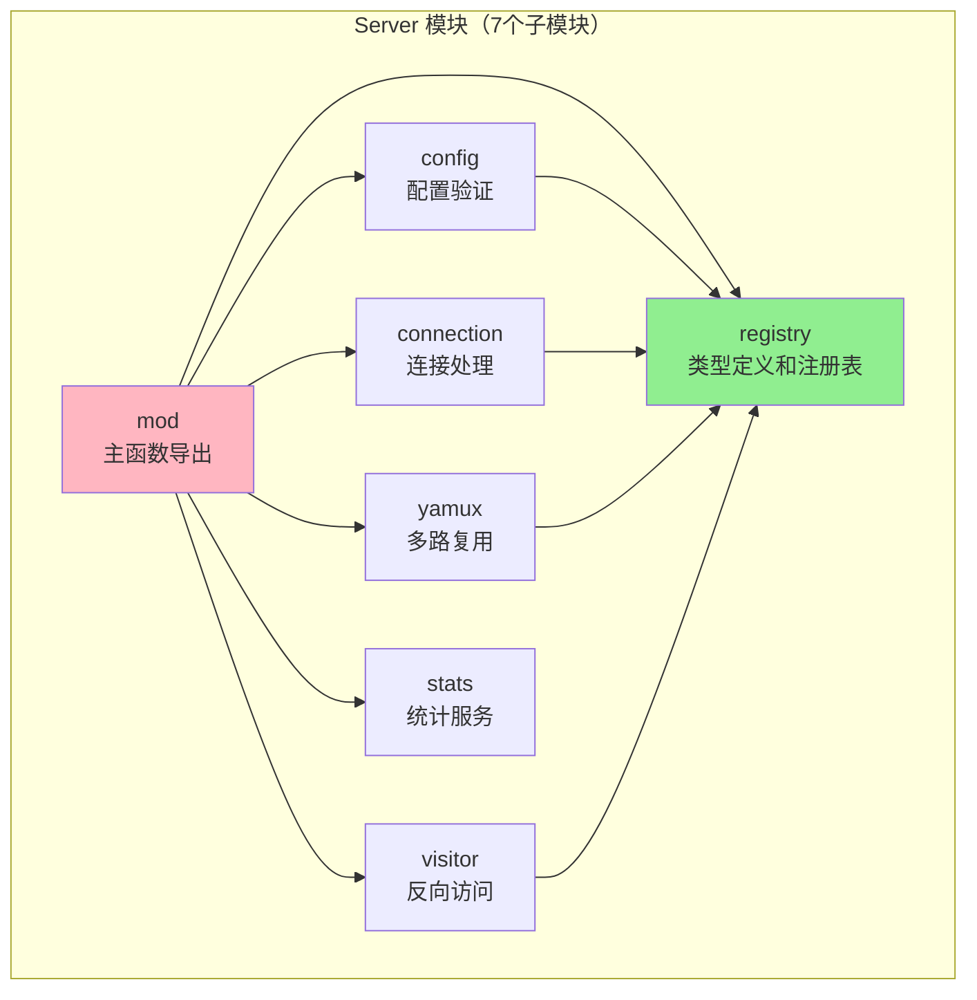

### Client 模块结构

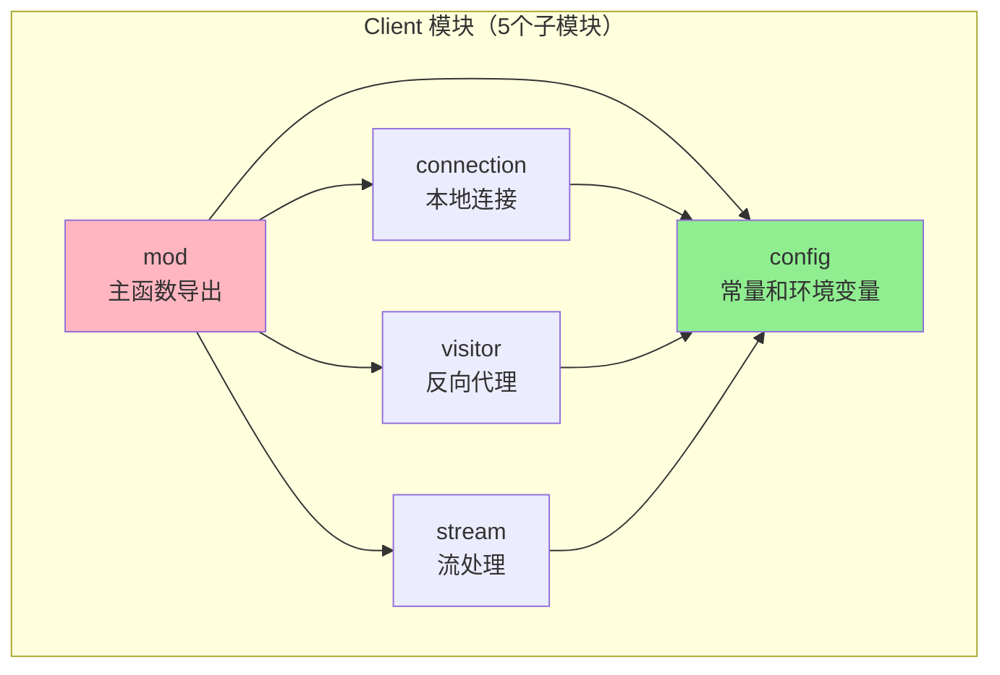

## Proxy 模式详细流程

### 时序图

外部用户通过服务器访问客户端的本地服务：

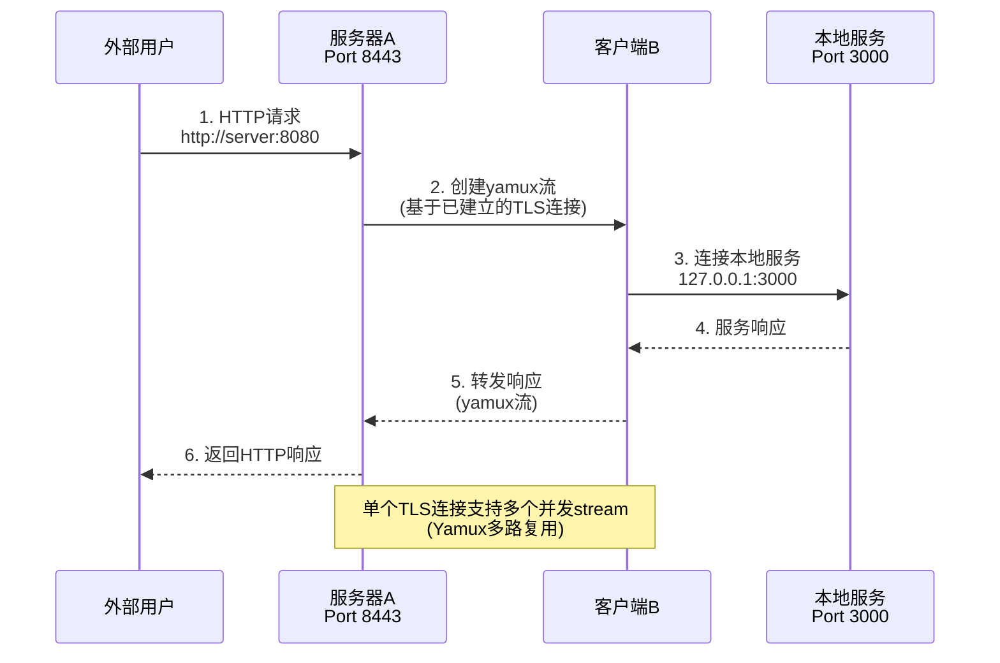

### 连接建立阶段

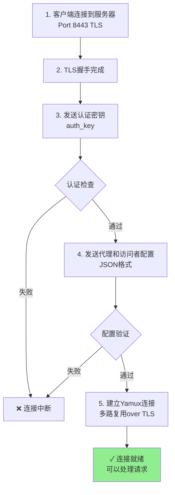

### 数据转发阶段

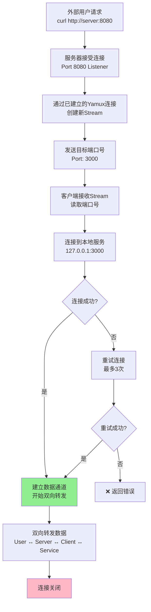

## Visitor 模式详细流程

### 时序图

客户端本地应用通过隧道访问另一个客户端的服务：

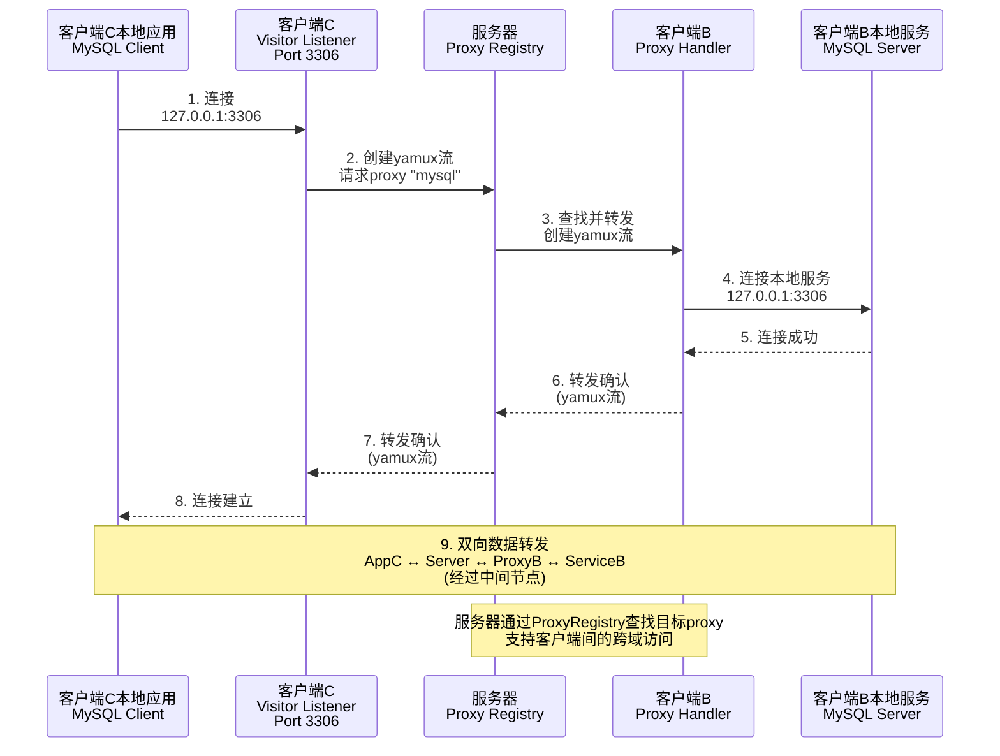

### 连接建立阶段

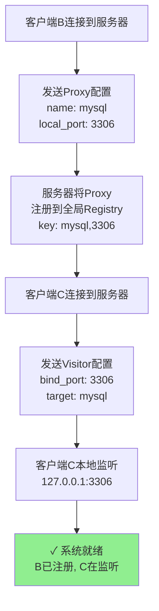

### 数据转发阶段

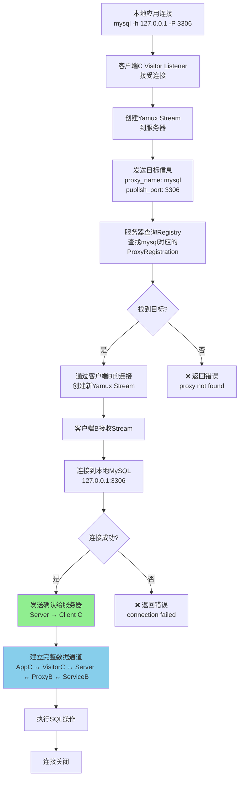

## Proxy Registry 机制

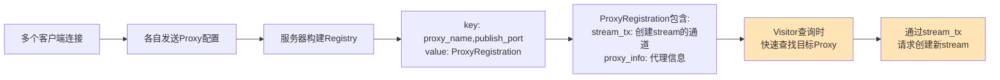

### Registry 设计特点

1. **Key 结构** - `(proxy_name, publish_port)`
   - 支持同一 proxy 在不同端口的多次发布
   - 快速查找目标 proxy

2. **Value 结构** - `ProxyRegistration`
   - `stream_tx`: 用于向客户端请求创建新的 yamux stream
   - `proxy_info`: 代理的详细信息（名称、地址、端口等）

3. **查询性能**
   - O(1) 时间复杂度的查找
   - 支持并发查询和更新

4. **生命周期**
   - 客户端连接时注册所有代理
   - 客户端断开时自动清理相关代理

## 关键设计特点

### 1. 多路复用 (Yamux)

- **单一连接**：每个客户端只需一条 TLS 连接到服务器
- **并发流**：单个连接支持数百个并发的独立数据流
- **性能优势**：避免了重复的 TLS 握手开销

### 2. 动态配置

- **服务器无配置**：服务器不需要预先配置代理列表
- **客户端提供**：客户端连接时动态告知服务器自己的代理信息
- **灵活性**：支持动态添加/删除代理，无需重启服务器

### 3. 双向通信

- **Proxy 模式**：从公网访问内网（传统反向代理）
- **Visitor 模式**：内网客户端互相访问（反向访问）
- **同时支持**：单个客户端可同时作为 Proxy 和 Visitor

### 4. 连接复用

**Proxy 模式**：
- 根据代理类型决定是否复用连接
- TCP 类型：不复用，每个连接独立
- HTTP/1.1 类型：支持连接复用，减少连接数
- HTTP/2.0 类型：强制单连接多路复用

**Visitor 模式**：
- 每个 visitor 请求使用独立的 stream
- 多个 visitor 共享同一条 TLS 连接
- 支持并发的 visitor 连接

### 5. 错误处理与重试

- **本地连接失败**：自动重试（默认 3 次）
- **认证失败**：立即断开，拒绝连接
- **配置校验失败**：返回详细错误信息
- **通信异常**：自动重连机制

## 性能特性

| 特性 | 说明 |
|------|------|
| **连接数** | 每个客户端仅需 1 条 TLS 连接 |
| **并发流** | 单个连接支持数百个并发 stream |
| **握手成本** | 摊销到所有流，大幅降低开销 |
| **内存占用** | O(client_count + active_streams) |
| **吞吐量** | 受限于网络带宽，不受连接数限制 |
| **延迟** | 相对于直连，增加一层中转延迟 |

## 扩展性考虑

1. **水平扩展**：部署多个服务器，使用负载均衡
2. **客户端扩展**：单服务器可支持数千个客户端连接
3. **流扩展**：每个连接可支持数百个并发流
4. **协议扩展**：支持多种传输协议（TLS/HTTP2/WSS）

## 参考资源

- [Yamux 多路复用协议](https://github.com/hashicorp/yamux)
- [Rustls TLS 实现](https://github.com/rustls/rustls)
- [Tokio 异步运行时](https://tokio.rs)
